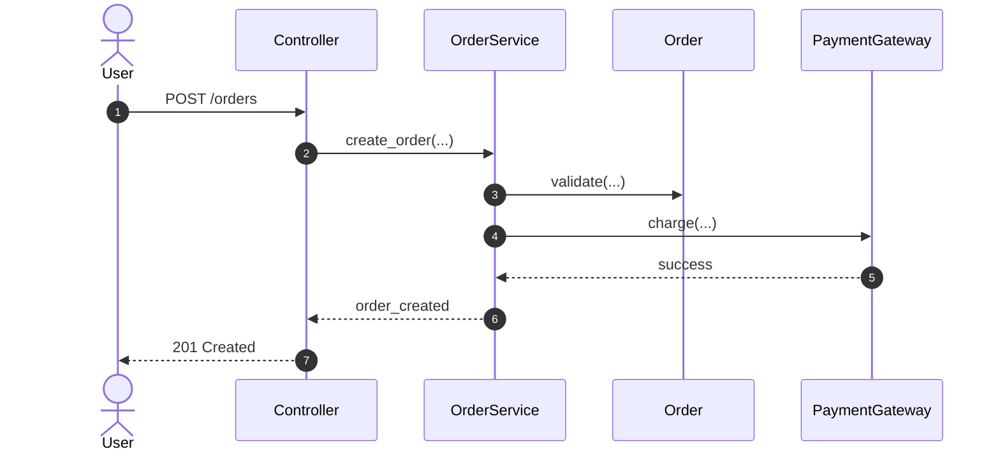

# Sequence Diagram Creator

## Overview

Create a sequence diagram from code, not from guesses. Ask where the diagram should start, trace the flow from that entry point, keep the scope inside the domain boundary by default, write the diagram as Mermaid, render it with `mmdc`, and provide a Safari command for opening the rendered file.

## Workflow

1. Ask for the entry point if the user did not provide one.
2. Identify the domain boundary for the repo.
3. Trace the execution path from the chosen entry point through the relevant collaborators.
4. Write a Mermaid sequence diagram file.
5. Render the Mermaid file with `mmdc`.
6. Return the created paths, the render command that was run, and a Safari open command for the rendered artifact.

## Ask For The Start Point

Do not guess the starting method, endpoint, job, command, or event handler when the user asks for a sequence diagram and has not named one.

Ask a short question such as:

`What entry point should the sequence diagram start from?`

Treat any of the following as valid entry points:

- HTTP route or controller action
- background job or worker method
- CLI command
- event subscriber or webhook handler
- service method or domain command handler

## Set The Boundary

Default the boundary to the domain layer.

Use these rules:

- Prefer `app/domain` when that path exists.
- If the repo uses a different structure, identify the equivalent domain package or module and state the assumption.
- Keep the diagram focused on the business flow inside that boundary.
- Show external participants only when the flow crosses the boundary and that crossing is important to understanding the sequence.
- Avoid pulling in every framework detail, serializer, or utility helper unless it materially changes the domain behavior.

## Trace The Flow From Code

Use code search first, then read the smallest set of files needed to confirm the path.

Recommended approach:

1. Locate the entry point implementation.
2. Follow direct calls, listeners, handlers, and delegated service objects.
3. Stop when the domain outcome is clear or when the flow leaves the domain boundary for non-essential infrastructure work.
4. Confirm branching behavior only when it changes the primary happy-path sequence or when the user asked for alternate paths.

Prefer a single primary scenario unless the user explicitly asks for multiple branches. If the code contains major forks, either:

- choose the dominant path and say so, or
- create an `alt` / `opt` Mermaid block when the branch is central to the behavior.

## Write The Mermaid File

Save the diagram as a Mermaid source file with a `.mmd` extension.

Use a filename derived from the entry point when practical, for example:

- `user-signup-sequence.mmd`
- `invoice-finalize-sequence.mmd`

Use Mermaid sequence diagram syntax. Keep participant names short and stable. Prefer domain concepts over raw file names.

Example skeleton:



## Render The Diagram

Render the Mermaid file with `mmdc`. Prefer SVG output so the rendered file opens cleanly in Safari and stays diff-friendly.

Default command shape:

```bash
mmdc -i path/to/diagram.mmd -o path/to/diagram.svg
```

If the user asked for another output format, honor that request. If `mmdc` is unavailable or fails, still leave the `.mmd` file in place and report the exact failure briefly.

## Return The Result

When the work is complete, provide:

- the Mermaid source path
- the rendered output path
- the exact `mmdc` command used
- a Safari open command for the rendered file

Use this open-command shape on macOS:

```bash
open -a Safari path/to/diagram.svg
```

If Safari is not appropriate for the rendered format, explain that and provide the closest useful open command.

## Quality Bar

Keep the diagram useful for engineering review:

- include only participants that matter to the traced behavior
- prefer readable domain labels over implementation noise
- annotate important external responses with brief return arrows
- avoid speculative calls that are not supported by the code
- mention assumptions when naming the domain boundary or choosing the main path
